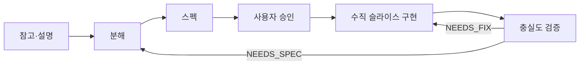

# Mental model

system-crew는 **추측으로 바로 코딩하지 않습니다.** 아래 순서를 고정합니다.

## 기본 원칙 (요약)

1. “비슷하게”의 기준을 먼저 고정: **충실 재현** vs **핵심만 영감**
2. 참고에 없는 기능은 임의 추가하지 않음 (필요하면 옵션으로 제안·승인)
3. 한 번에 게임 전체가 아니라 **한 시스템 / 수직 슬라이스**
4. 성격이 다른 일이 섞이면 **Stage로 나누고 현재 Stage만**
5. 참고 분석은 `docs/references/`에 **자산화** (콜아웃과 관찰 분리)
6. 사용자 **아이디어**는 평가 없이 적용하지 않음
7. 프로토콜 밖 요청은 4역할 루프에 끼워 맞추지 않음
8. Implementer는 **컴파일만으로 완료하지 않음** — 런타임 검증
9. 검증용 일시 치트·스킵은 검증 후 폐기
10. Agent Playtest 자동화는 **호스트 프로젝트** 인프라 (팩에 코드 이식하지 않음)
11. `REJECT`는 제품 채택 거절이지, 실험 재시도 금지가 아님

에이전트 원문: 레포 루트 `AGENTS.md`
