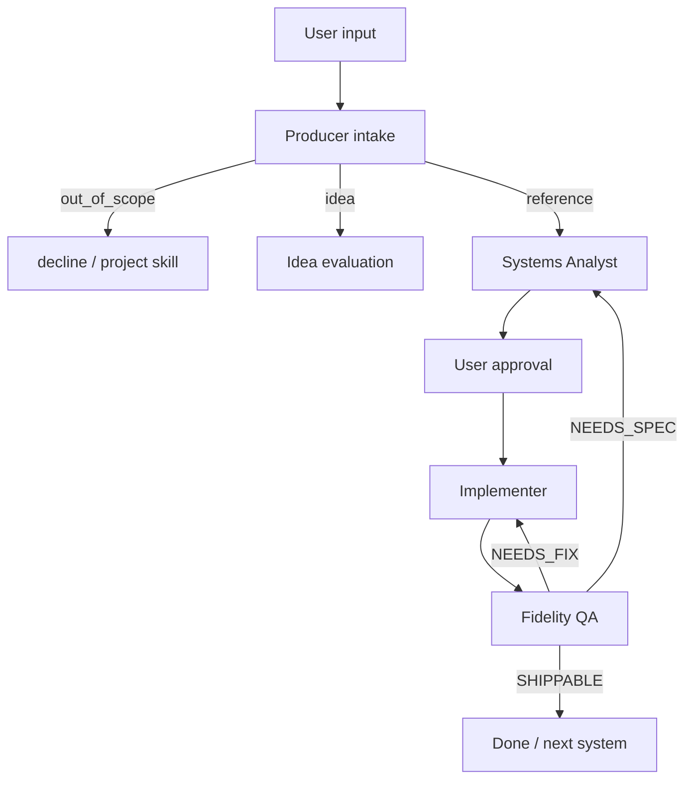

# From reference

사용자가 시스템 설명 또는 참고(영상·게임·콘텐츠)를 주면 이 루프를 따릅니다.



## Phase 0 — Intake (Producer)

- 참고 목록(URL, 게임명, 타임스탬프, 구간)
- User callouts, Similarity, In/Out scope, 성공 조건
- 기본 자산화: `docs/references/`
- 프로토콜 밖·혼합이면 루프/Stage 처리

## Phase 1 — Analyze (Systems Analyst)

1. INDEX에서 유사 자산 검색
2. 자산 폴더 생성 또는 재사용 합의
3. callouts → brief → ASSET → system-spec
4. INDEX 갱신, Open questions
5. Producer가 승인 요청

## Phase 2 — Implement

- 승인 스펙만, 수직 슬라이스
- How to playtest + **런타임** 검증
- 일시 치트는 검증 후 폐기

## Phase 3 — Verify (Fidelity QA)

- fidelity-report, 자산 Status 갱신
- `SHIPPABLE` / `NEEDS_FIX` / `NEEDS_SPEC` / `BLOCKED`

## Cursor 호출 예

```text
Producer로 intake 해줘. 참고: … / 내가 짚은 점: …
Systems Analyst로 reference asset이랑 spec 작성
스펙 승인했어. Implementer로 구현
Fidelity QA로 검수하고 자산 상태 갱신
```
